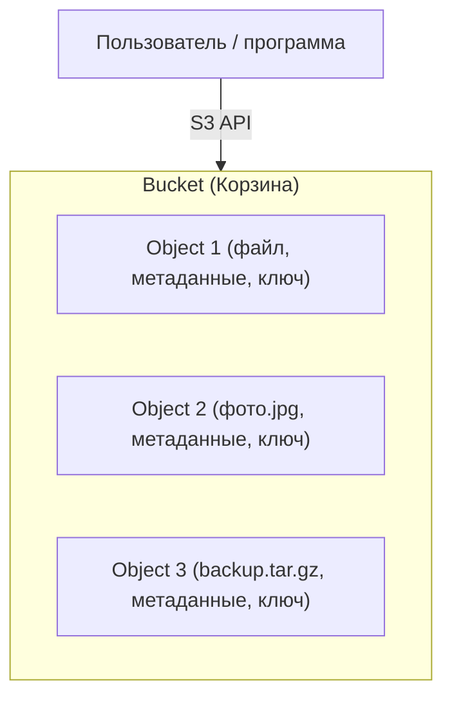
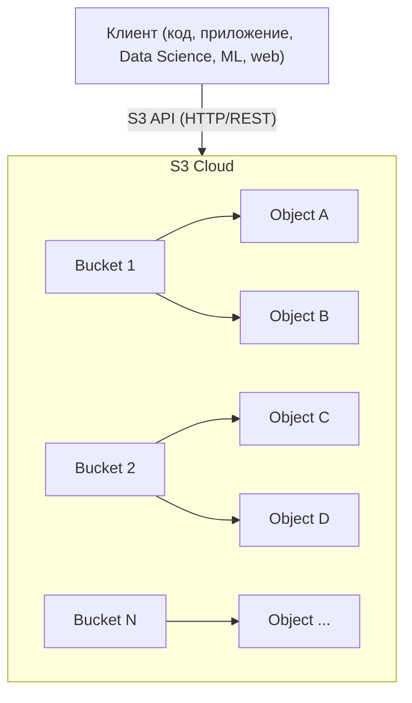
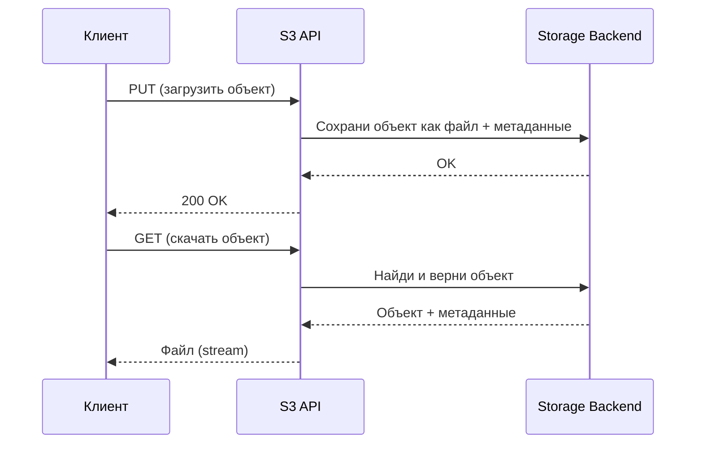

# S3 как стандарт объектного хранения

Пет-проект для практического знакомства с S3-совместимым объектным хранилищем — фундаментальной технологией современной дата-инженерии. Проект разворачивает локальное объектное хранилище (MinIO) в Docker и демонстрирует полный цикл работы с ним через S3 API: создание и удаление бакетов, загрузку и чтение объектов разными клиентами — нативным S3-клиентом (`minio`), `boto3`, DuckDB и Pandas. Один и тот же код работает с любым S3-совместимым хранилищем (MinIO, Selectel, VK Cloud, AWS), потому что S3 API — открытый стандарт.

## Стек


## Структура проекта

```
pet_project_s3_as_standard/
├── data/                       # локальные данные MinIO (создаётся Docker)
├── demo_scripts/               # демо-скрипты, запускаются как модули
│   ├── list_bucket.py
│   ├── list_objects.py
│   ├── upload_object.py
│   ├── create_bucket.py
│   ├── create_remove_bucket.py
│   ├── duckdb_copy_to_s3.py
│   ├── duckdb_read_from_s3.py
│   ├── pandas_dataframe_to_s3.py
│   └── pandas_dataframe_from_s3.py
├── utils/                      # переиспользуемая логика
│   ├── s3_utils.py             # minio + boto3 клиенты, S3_CONFIGS
│   ├── duckdb_utils.py         # запись/чтение через DuckDB
│   └── pandas_utils.py         # запись/чтение через Pandas
├── cred_example.py             # шаблон учётных данных (в репозитории)
├── cred.py                     # реальные ключи (создаётся локально, в .gitignore)
├── docker-compose.yaml         # поднимает MinIO
├── pyproject.toml              # зависимости проекта (Poetry)
├── titanic.csv                 # тестовый датасет
└── README.md
```

`utils/` и `demo_scripts/` — это Python-пакеты. Скрипты запускаются как модули из корня проекта (`python -m demo_scripts.<имя>`), поэтому импорты вида `from utils.s3_utils import ...` работают корректно.

## Пошаговая установка и запуск

Инструкция учитывает реальный порядок действий, включая типичные подводные камни на Windows / PowerShell.

### 1. Поднять MinIO в Docker

```bash
docker compose up -d
```

После старта будут доступны:
- **S3 API** — `http://localhost:9000`
- **Веб-консоль** — `http://localhost:9001` (логин/пароль из `docker-compose.yaml`)

> MinIO в Docker — это **сервер** (хранилище). Python-библиотеки (`boto3`, `minio`, `duckdb`, `pandas`) ставятся отдельно в виртуальное окружение — это **клиенты**, которые из вашего кода обращаются к серверу. Сервер и клиент — разные стороны: в контейнере клиентских библиотек нет и быть не должно.

### 2. Создать виртуальное окружение

**Linux / macOS:**

```bash
python3.12 -m venv venv
source venv/bin/activate
```

**Windows (PowerShell):**

```powershell
py -m venv venv
.\venv\Scripts\Activate.ps1
```

После активации в начале строки терминала появится `(venv)`.

> **Грабли Windows №1 — `python` не найден.** Если `python -m venv venv` выдаёт «Python was not found; run … from the Microsoft Store», значит команду перехватывает заглушка Microsoft Store. Используйте `py` вместо `python`, либо отключите перехват в *Settings → Apps → Advanced app settings → App execution aliases* (тумблеры `python.exe` и `python3.exe`).
>
> **Грабли Windows №2 — execution policy.** Если активация падает с ошибкой про запрет выполнения скриптов, разрешите для текущей сессии и повторите:
> ```powershell
> Set-ExecutionPolicy -Scope Process -Bypass
> .\venv\Scripts\Activate.ps1
> ```

### 3. Установить зависимости

Рекомендуемый способ — поставить весь набор сразу из `pyproject.toml`, чтобы не доустанавливать пакеты по одному:

```bash
pip install --upgrade pip
pip install poetry
poetry install
```

Если ставить вручную, проекту нужны как минимум:

```bash
pip install boto3 minio duckdb pandas numpy s3fs
```

Зачем каждый пакет:
- `minio`, `boto3` — два S3-клиента (нативный и AWS SDK).
- `duckdb` — запись/чтение CSV прямо в S3 средствами DuckDB.
- `pandas` + `numpy` — DuckDB-метод `.df()` конвертирует результат в DataFrame, для этого нужен pandas (а ему — numpy).
- `s3fs` (тянет `fsspec`) — pandas пишет и читает по `s3://`-путям через файловую абстракцию fsspec, реализацию для S3 даёт s3fs.

> **Замечание о конфликте версий.** При установке `s3fs` через pip возможно предупреждение, что `aiobotocore` тянет более старую `botocore`, чем требует `boto3`. На работу демо это не влияет, но чище ставить всё через `poetry install` — Poetry разрешает версии согласованно.

### 4. Создать файл с учётными данными

Скрипты импортируют `from cred import ...`, но в репозитории лежит только шаблон `cred_example.py`. Скопируйте его и заполните реальными ключами:

**Linux / macOS:**

```bash
cp cred_example.py cred.py
```

**Windows (PowerShell):**

```powershell
Copy-Item cred_example.py cred.py
```

Для локального MinIO значения уже подходящие (endpoint `localhost:9000`, ключи из консоли MinIO, бакет `test`). Поля для Selectel / VK / AWS можно оставить пустыми, если облачные провайдеры не используются.

> `cred.py` содержит секреты и должен быть в `.gitignore` — не коммитьте его.

### 5. Скачать тестовый датасет

В корень проекта (используется в демо загрузки/чтения):

```bash
curl -LfO https://raw.githubusercontent.com/datasciencedojo/datasets/master/titanic.csv
```

### 6. Запускать демо-скрипты как модули

Запуск **только из корня проекта** и **через `-m`**, без `.py` в конце:

```bash
python -m demo_scripts.list_bucket
```

> **Грабли №3 — `ModuleNotFoundError: No module named 'utils'`.** Возникает, если запускать файл напрямую (`python demo_scripts/list_bucket.py`): Python кладёт в путь поиска папку самого скрипта, а не корень, и пакет `utils` не находится. Запуск через `python -m demo_scripts.list_bucket` из корня решает проблему.
>
> **Грабли №4 — лишний `.py`.** `python -m demo_scripts.duckdb_copy_to_s3.py` — ошибка: при `-m` точки разделяют пакеты, а `.py` Python примет за подмодуль. Правильно — без расширения.

## Демонстрация: полный цикл по шагам

Скрипты ниже показывают весь жизненный цикл работы с объектным хранилищем. Запускаются из корня через `python -m demo_scripts.<имя>`.

### Список бакетов

```bash
python -m demo_scripts.list_bucket
```

Оба клиента видят один и тот же бакет:

```
🦩 With Minio client; Buckets (minio) in minio:
test 2026-06-09 20:36:27...
🪣 With Boto3 client; Buckets (boto3) in minio:
test 2026-06-09 20:36:27...
```

### Список объектов (пустой бакет)

```bash
python -m demo_scripts.list_objects
```

### Загрузка файла

```bash
python -m demo_scripts.upload_object
```

```
🦩 With Minio client; Uploaded titanic_minio_client.csv to test in minio
🪣 With Boto3 client; Uploaded titanic_boto3_client.csv to test in minio
```

> **Грабли №5 — `FileNotFoundError: '../titanic.csv'`.** В скрипте путь задан относительным (`../titanic.csv`) в расчёте на запуск из папки `demo_scripts/`. При запуске через `-m` из корня рабочая директория — корень, поэтому путь нужно указывать без `../`: `file_path="titanic.csv"`.

### Список объектов (после загрузки)

```bash
python -m demo_scripts.list_objects
```

```
titanic_boto3_client.csv  61194  ...
titanic_minio_client.csv  61194  ...
```

Одинаковый размер (61194 байт) у объектов, загруженных разными клиентами, подтверждает: оба клиента пишут идентичные данные через единый S3 API.

### Создание и удаление бакета

```bash
python -m demo_scripts.create_remove_bucket
python -m demo_scripts.create_bucket
python -m demo_scripts.list_bucket
```

### DuckDB: запись и чтение прямо в S3

```bash
python -m demo_scripts.duckdb_copy_to_s3     # CSV written to s3://test/file.csv
python -m demo_scripts.duckdb_read_from_s3   # читает обратно и печатает DataFrame
```

### Pandas: запись и чтение через s3://

```bash
python -m demo_scripts.pandas_dataframe_to_s3    # DataFrame → s3://test/pandas_to_s3.csv
python -m demo_scripts.pandas_dataframe_from_s3  # читает обратно
```

### Итоговая проверка

```bash
python -m demo_scripts.list_objects
```

В бакете `test` будут лежать объекты, записанные всеми способами:

```
file.csv                  (DuckDB)
pandas_to_s3.csv          (Pandas)
titanic_boto3_client.csv  (boto3)
titanic_minio_client.csv  (minio)
```

**Ключевой вывод проекта:** один и тот же S3 API одинаково обслуживает разные клиенты (нативный, boto3, DuckDB, Pandas) и разные хранилища — код не зависит от конкретной реализации. Это и делает S3 стандартом де-факто.

## Работа с несколькими провайдерами

Все S3-провайдеры описаны в словаре `S3_CONFIGS` (`utils/s3_utils.py`): MinIO, Selectel, VK Cloud, AWS. Демо-скрипты по умолчанию перебирают несколько провайдеров. Если реальные ключи заполнены только для MinIO, вызовы к Selectel / VK / AWS завершатся ошибкой `AccessDenied (403)` — это ожидаемо.

Чтобы прогонять только MinIO, закомментируйте в нужном скрипте строки с другими провайдерами, оставив вызовы с `S3_CONFIGS["minio"]`.

## Что такое объектное хранилище и S3

### Классические типы хранения

- **Файловое хранилище (File Storage).** Файлы лежат в папках и подчиняются файловой иерархии (`папка/файл.txt`). Подходит для мелких файлов, рабочих станций, домашнего использования.
- **Блочное хранилище (Block Storage).** Данные разбиты на блоки фиксированного размера (жёсткий диск, SSD, iSCSI). Используется для баз данных и виртуальных машин, где важна скорость.
- **Объектное хранилище (Object Storage).** Данные хранятся как «объекты». Каждый объект = файл + метаданные + уникальный ключ. Структуры папок нет, есть бакеты (buckets) — большие контейнеры.

### Что такое S3

**S3 (Simple Storage Service)** — сервис объектного хранения и де-факто стандарт для хранения больших объёмов данных в облаке: логи, резервные копии, крупные датасеты, медиаархивы, data lake.

**S3 API** — набор стандартных HTTP-запросов для работы с объектами (`PUT`, `GET`, `DELETE`, `LIST` и др.). Идея S3 реализована множеством хранилищ: MinIO, Selectel, VK Cloud, Yandex Cloud, Google Cloud Storage и другими. Благодаря единому API один и тот же код переносится между ними без изменений.

### Как устроено объектное хранилище



- **Bucket** — контейнер для объектов (аналог папки верхнего уровня).
- **Object** — любые данные (файл), хранящиеся внутри бакета.
- **Метаданные** — информация о файле (дата, тип, кастомные теги).
- **Ключ (key)** — уникальное имя объекта внутри бакета (например, `2024/photos/image1.jpg`).

### Ключевые особенности

- Нет реальной древовидной структуры — всё хранится «плоско», но ключи могут имитировать пути.
- Масштабируется до триллионов объектов.
- Дешёвое и надёжное хранение.
- Хорошо подходит для Data Lake, backup, Big Data, архивов и ML/DL-задач.
- Доступ по сети через REST / S3 API.

### Почему S3 так популярен

- **Открытый стандарт** — легко мигрировать между облаками и on-premises.
- **Масштабируемость** и высокая доступность.
- **Гибкое управление доступом** (IAM, политики, временные ссылки).
- **Широкая поддержка инструментов** — pandas, boto3, minio-py, s3cmd, DuckDB и другие.

## Архитектура



### Ключевые элементы

- **Бакеты (Buckets)** — логические контейнеры для объектов. В каждом могут быть миллионы и миллиарды объектов; имя бакета уникально в пределах облака.
- **Объекты (Objects)** — файл + метаданные + уникальный ключ (например, `data/2024/report.csv`). Реальных папок нет, только имитация через ключи.
- **S3 API (REST/HTTP)** — вся работа идёт через стандартные HTTP-запросы (`PUT`, `GET`, `DELETE`, `LIST`). Достаточно знать endpoint, ключи доступа, имя бакета и имя объекта.

### Как выглядит взаимодействие

1. **Клиент** (код, pandas, boto3, minio-py, ML-пайплайн) отправляет запрос — например, загрузить файл или получить список объектов.
2. **S3 Gateway (API endpoint)** принимает запрос, аутентифицирует и авторизует пользователя по ключам.
3. **Storage Backend** физически хранит объекты (диски, кластер серверов, репликация, шардирование).
4. **Ответ клиенту** — результат: файл, статус или список объектов.



### Как обеспечивается надёжность

- **Репликация** — данные автоматически копируются на несколько серверов или в разные дата-центры.
- **Версионирование** — можно хранить все версии файла.
- **Политики доступа и шифрование** — доступ через IAM/ACL, шифрование «на лету» и «на диске».