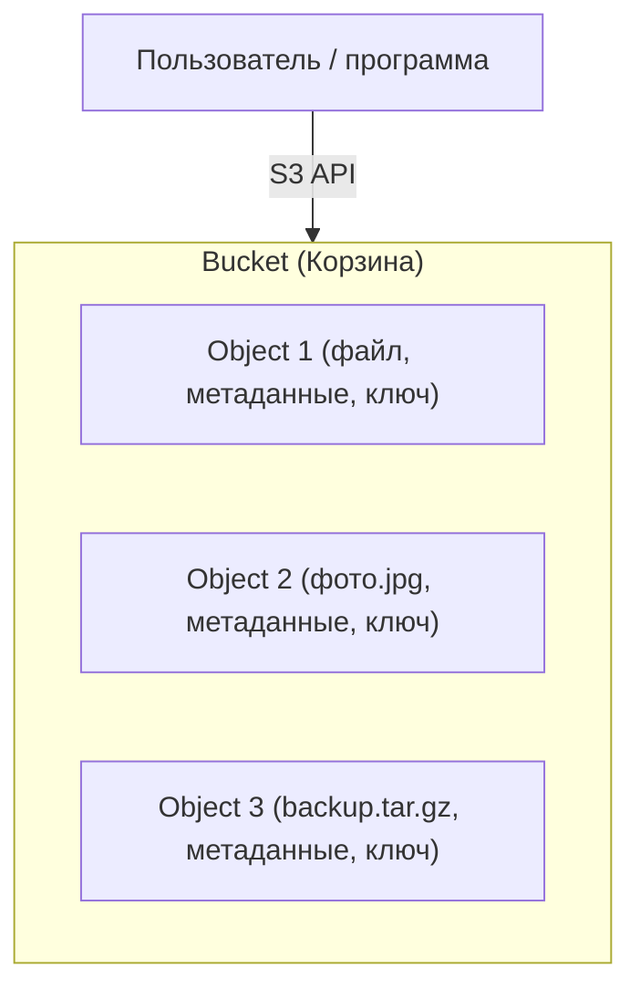
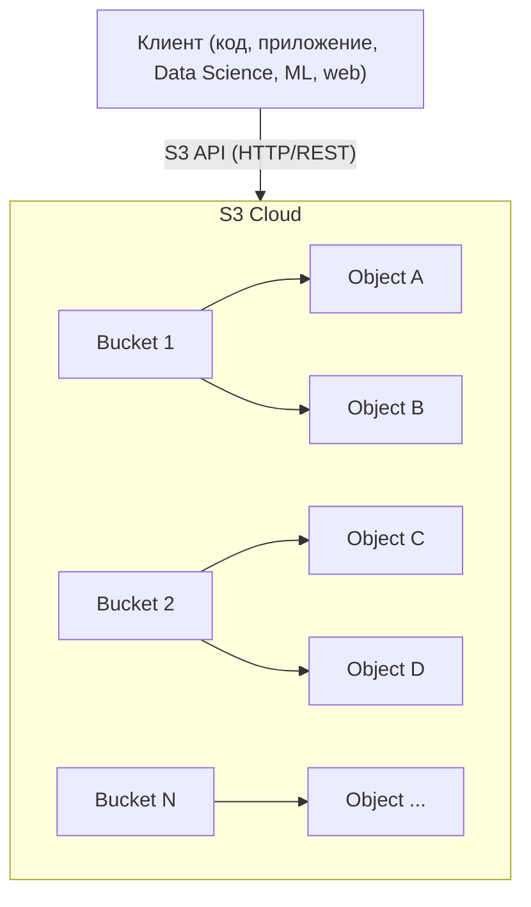
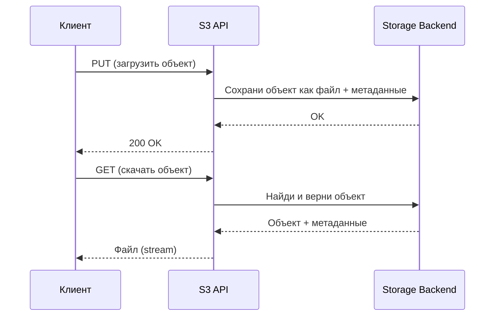

# S3 как стандарт объектного хранения

Пет-проект для практического знакомства с S3-совместимым объектным хранилищем — фундаментальной технологией современной дата-инженерии. Проект разворачивает локальное объектное хранилище в Docker и демонстрирует полный цикл работы с ним через S3 API: создание бакетов, загрузку и чтение объектов разными клиентами (нативный S3-клиент, DuckDB, Pandas). Один и тот же код работает с любым S3-совместимым хранилищем, потому что S3 API — открытый стандарт.

## Стек


## Быстрый старт

### Создание виртуального окружения

```bash
python3.12 -m venv venv && \
source venv/bin/activate && \
pip install --upgrade pip && \
pip install poetry && \
poetry lock && \
poetry install
```

Добавление новых зависимостей:

```bash
poetry add <package_name>=<version>
poetry lock && poetry install
```

### Разворачивание инфраструктуры

```bash
docker-compose up -d
```

### Получение тестового датасета

Скачать датасет Titanic в корень проекта (используется в демо загрузки/чтения):

```bash
curl -LfO https://raw.githubusercontent.com/datasciencedojo/datasets/master/titanic.csv
```

## Что такое объектное хранилище и S3

### Классические типы хранения

- **Файловое хранилище (File Storage).** Файлы лежат в папках и подчиняются файловой иерархии (`папка/файл.txt`). Подходит для мелких файлов, рабочих станций, домашнего использования.
- **Блочное хранилище (Block Storage).** Данные разбиты на блоки фиксированного размера (жёсткий диск, SSD, iSCSI). Используется для баз данных и виртуальных машин, где важна скорость.
- **Объектное хранилище (Object Storage).** Данные хранятся как «объекты». Каждый объект = файл + метаданные + уникальный ключ. Структуры папок нет, есть бакеты (buckets) — большие контейнеры.

### Что такое S3

**S3 (Simple Storage Service)** — сервис объектного хранения и де-факто стандарт для хранения больших объёмов данных в облаке: логи, резервные копии, крупные датасеты, медиаархивы, data lake.

**S3 API** — набор стандартных HTTP-запросов для работы с объектами (`PUT`, `GET`, `DELETE`, `LIST` и др.). Идея S3 реализована множеством хранилищ: MinIO, Selectel, VK Cloud, Yandex Cloud, Google Cloud Storage и другими. Благодаря единому API один и тот же код переносится между ними без изменений.

### Как устроено объектное хранилище



- **Bucket** — контейнер для объектов (аналог папки верхнего уровня).
- **Object** — любые данные (файл), хранящиеся внутри бакета.
- **Метаданные** — информация о файле (дата, тип, кастомные теги).
- **Ключ (key)** — уникальное имя объекта внутри бакета (например, `2024/photos/image1.jpg`).

### Ключевые особенности

- Нет реальной древовидной структуры — всё хранится «плоско», но ключи могут имитировать пути.
- Масштабируется до триллионов объектов.
- Дешёвое и надёжное хранение.
- Хорошо подходит для Data Lake, backup, Big Data, архивов и ML/DL-задач.
- Доступ по сети через REST / S3 API.

### Почему S3 так популярен

- **Открытый стандарт** — легко мигрировать между облаками и on-premises.
- **Масштабируемость** и высокая доступность.
- **Гибкое управление доступом** (IAM, политики, временные ссылки).
- **Широкая поддержка инструментов** — pandas, boto3, minio-py, s3cmd, DuckDB и другие.

## Архитектура



### Ключевые элементы

- **Бакеты (Buckets)** — логические контейнеры для объектов. В каждом могут быть миллионы и миллиарды объектов; имя бакета уникально в пределах облака.
- **Объекты (Objects)** — файл + метаданные + уникальный ключ (например, `data/2024/report.csv`). Реальных папок нет, только имитация через ключи.
- **S3 API (REST/HTTP)** — вся работа идёт через стандартные HTTP-запросы (`PUT`, `GET`, `DELETE`, `LIST`). Достаточно знать endpoint, ключи доступа, имя бакета и имя объекта.

### Как выглядит взаимодействие

1. **Клиент** (код, pandas, boto3, minio-py, ML-пайплайн) отправляет запрос — например, загрузить файл или получить список объектов.
2. **S3 Gateway (API endpoint)** принимает запрос, аутентифицирует и авторизует пользователя по ключам.
3. **Storage Backend** физически хранит объекты (диски, кластер серверов, репликация, шардирование).
4. **Ответ клиенту** — результат: файл, статус или список объектов.



### Как обеспечивается надёжность

- **Репликация** — данные автоматически копируются на несколько серверов или в разные дата-центры.
- **Версионирование** — можно хранить все версии файла.
- **Политики доступа и шифрование** — доступ через IAM/ACL, шифрование «на лету» и «на диске».

## Демонстрация

Скрипты выполняются по порядку и показывают полный цикл работы с S3 разными клиентами:

1. `list_bucket.py` — показать существующие бакеты и убедиться, что все клиенты успешно работают с S3.
2. `list_objects.py` — убедиться, что бакеты пустые.
3. `upload_object.py` — загрузить файл с данными Titanic в бакеты.
4. `list_objects.py` — убедиться, что объекты появились.
5. `create_remove_bucket.py` — создать и удалить бакет.
6. `create_bucket.py` — создать бакеты.
7. `list_bucket.py` — показать текущий список бакетов.
8. `duckdb_copy_to_s3.py` — загрузить данные в S3 через DuckDB.
9. `duckdb_read_from_s3.py` — прочитать данные из S3 через DuckDB.
10. `pandas_dataframe_to_s3.py` — загрузить данные в S3 через Pandas.
11. `pandas_dataframe_from_s3.py` — прочитать данные из S3 через Pandas.
12. `list_objects.py` — убедиться, что все записанные данные присутствуют в бакетах.

Ключевая идея демо: один и тот же S3 API одинаково обслуживает разные клиенты (нативный S3-клиент, DuckDB, Pandas) и разные хранилища — код не зависит от конкретной реализации.